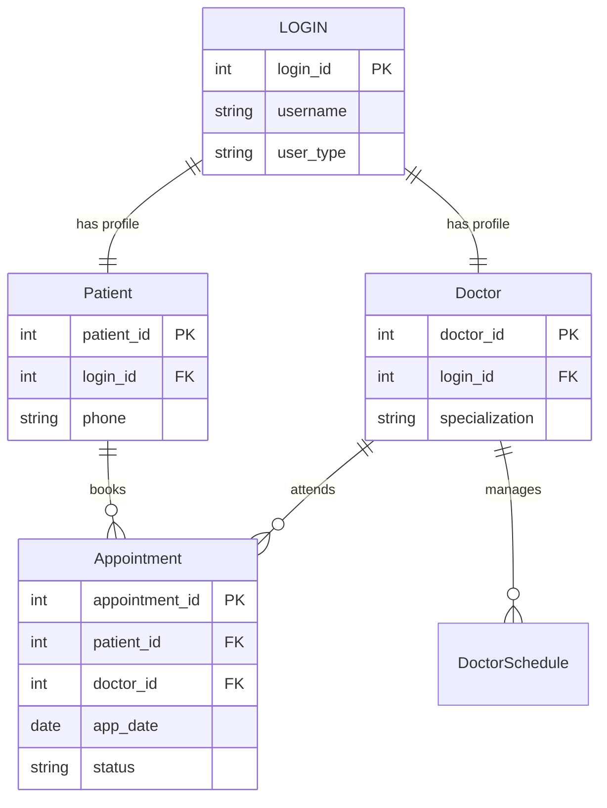
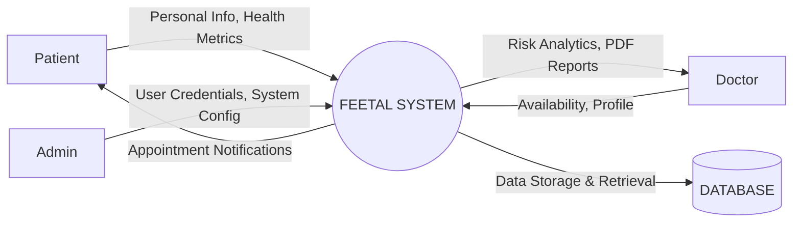
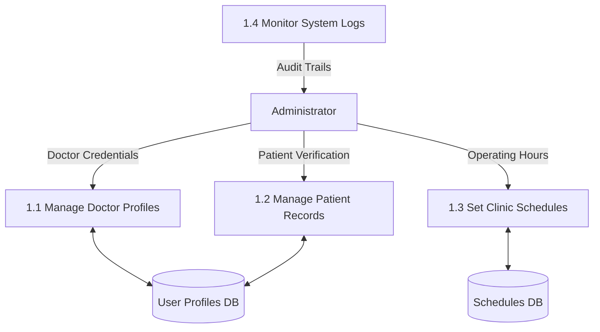
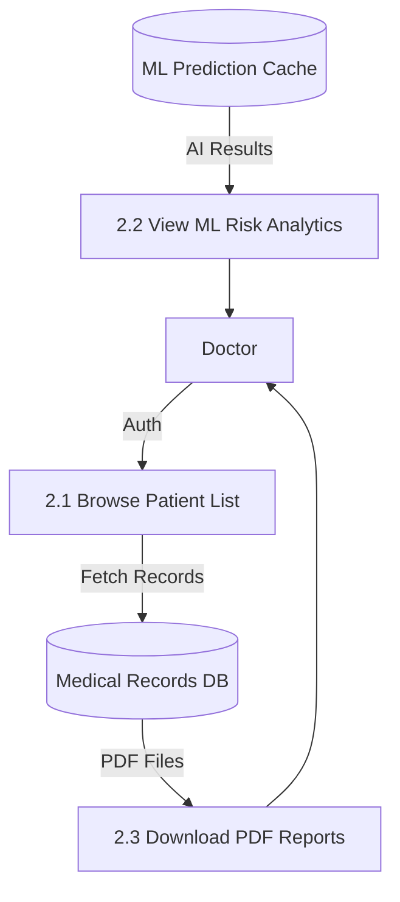
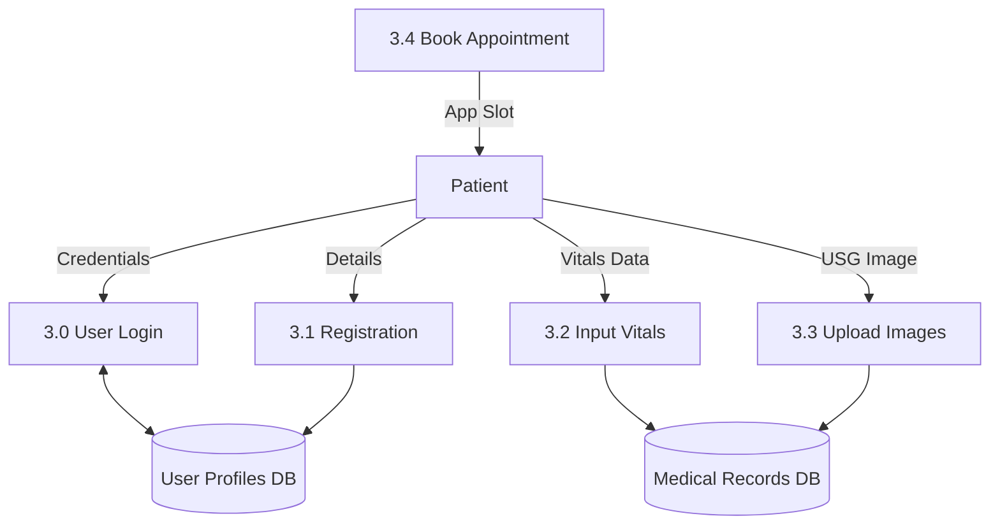
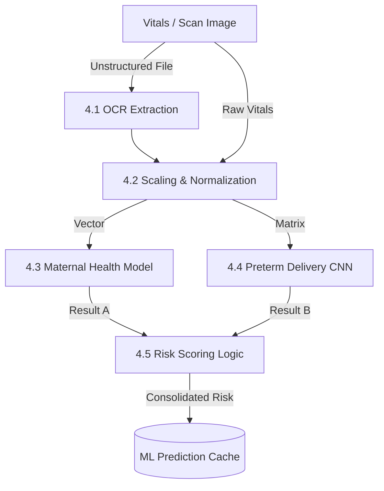
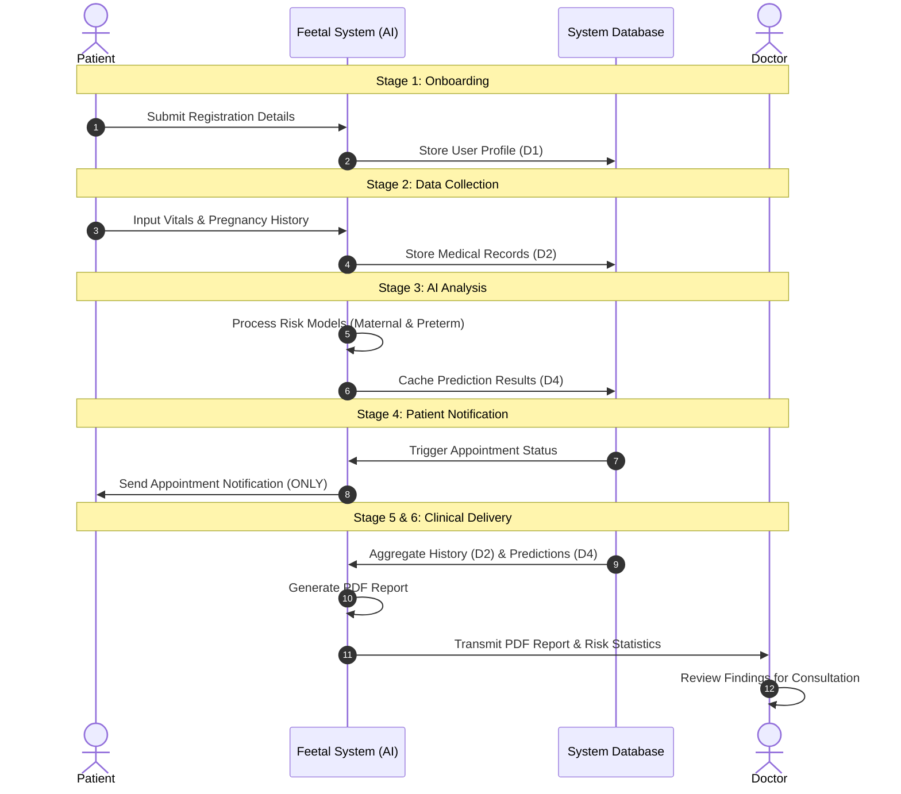

# PROJECT SPECIFICATION: FEETAL (FETOSCOPE)

---

## PROJECT REFERENCE & DOCUMENT DATA

| Attribute | Details |
| :--- | :--- |
| **Project Name** | Feetal (FetoScope) |
| **Project ID** | FEETAL-2026-v1 |
| **Document Type** | System Specification & Data Architecture |
| **Version** | 1.0.4 |
| **Contact / Author** | Development Team (Maitexa) |
| **Last Updated** | March 06, 2026 |
| **Status** | Active / Under Development |

---

# 3. SYSTEM SPECIFICATIONS

## 3.1 HARDWARE SPECIFICATION

| Component | Minimum Requirement |
| :--- | :--- |
| **Processor** | Intel Core i3 or above |
| **System Bus** | 32-bit or 64-bit |
| **RAM** | 4 GB or above |
| **HDD / SSD** | 500 GB or above |
| **Monitor** | 14" LCD or above |
| **Keyboard** | 108 Keys |
| **Mouse** | Any Optical Mouse |

---

## 3.2 SOFTWARE SPECIFICATION

| Component | Specification |
| :--- | :--- |
| **Operating System** | Windows 10 / 11 (64-bit) |
| **Front End** | HTML5, CSS3, JavaScript (Django Templates) |
| **Back End** | Python (Django Framework) |
| **Database** | SQLite / MySQL Server |
| **AI / ML Library** | TensorFlow, Keras, Scikit-learn |
| **IDE** | Visual Studio Code / PyCharm |
| **Python Version** | 3.10 or above |

---

> [!NOTE]
> This specification is tailored for the **Feetal (FetoScope)** project, ensuring optimal performance for running machine learning models and processing medical reports.

---

## 3.3 DATABASE DESIGN (TABLES)

The following tables represent the core data structure of the **Feetal** system.

### **<u>In memory data</u>**

#### **Table 1: LOGIN**
| Field Name | Data Type | Constraints |
| :--- | :--- | :--- |
| Login_id | Int(11) | Primary key |
| Username | Varchar(50) | Not null |
| Password | Varchar(128) | Not null |
| Email | Varchar(100) | Not null |
| User_type | Varchar(30) | Not null |

#### **Table 2: DOCTOR**
| Field Name | Data Type | Constraints |
| :--- | :--- | :--- |
| Doctor_id | Int(11) | Primary key |
| Login_id | Int(11) | Foreign key |
| Phone | Varchar(20) | Not null |
| Specialization | Varchar(50) | Not null |
| Created_at | DateTime | Not null |

#### **Table 3: PATIENT**
| Field Name | Data Type | Constraints |
| :--- | :--- | :--- |
| Patient_id | Int(11) | Primary key |
| Login_id | Int(11) | Foreign key |
| Phone | Varchar(20) | Not null |
| Created_at | DateTime | Not null |

#### **Table 4: APPOINTMENT**
| Field Name | Data Type | Constraints |
| :--- | :--- | :--- |
| Appointment_id | Int(11) | Primary key |
| Patient_id | Int(11) | Foreign key |
| Doctor_id | Int(11) | Foreign key |
| App_Date | Date | Not null |
| App_Time | Time | Not null |
| Status | Varchar(20) | Not null |

#### **Table 5: ML_REPORT**
| Field Name | Data Type | Constraints |
| :--- | :--- | :--- |
| Report_id | Int(11) | Primary key |
| Patient_name | Varchar(255) | Not null |
| Analysis_type | Varchar(50) | Not null |
| Risk_level | Varchar(20) | Not null |
| Confidence | Int(11) | Not null |

#### **Table 6: DOCTOR_SCHEDULE**
| Field Name | Data Type | Constraints |
| :--- | :--- | :--- |
| Schedule_id | Int(11) | Primary key |
| Doctor_id | Int(11) | Foreign key |
| Available_Day | Varchar(20) | Not null |
| Start_Time | Time | Not null |
| End_Time | Time | Not null |

---

### 3.3.4 ENTITY RELATIONSHIP DIAGRAM (ERD)

---

## 3.4 DATA FLOW DIAGRAM (DFD)

The following diagrams illustrate the movement of data through the Feetal (FetoScope) system across multiple administrative and functional levels.

### 3.4.1 LEVEL 0 DFD (CONTEXT DIAGRAM)
The Context Diagram shows the system boundary and its interactions with external entities.

### 3.4.2 LEVEL 1 DFD (ADMIN LEVEL)
Focuses on user management, system monitoring, and scheduling.

### 3.4.3 LEVEL 2 DFD (DOCTOR LEVEL)
Focuses on clinical review, report access, and consultation queue.

### 3.4.4 LEVEL 3 DFD (PATIENT LEVEL)
Focuses on data entry, registration, and booking.

### 3.4.5 LEVEL 4 DFD (ML FUNCTIONS)
Detailed breakdown of the AI/ML Prediction Engine logic.

---

### 3.4.3 STEP-BY-STEP DATA FLOW PROCESS

The following steps define the complete operational flow of data within the Feetal system:

1.  **Stage 1: User Onboarding**
    *   **Patient/Doctor** provides registration details to **Process 1.0**.
    *   Data is validated and stored in **D1 (User Profiles DB)**.

2.  **Stage 2: Health Data Collection**
    *   **Patient** enters vitals (BP, Heart Rate, BS) and pregnancy history (Gestational Age, BMI) via the portal.
    *   **Process 2.0** normalizes this data and stores it in **D2 (Medical Records DB)**.

3.  **Stage 3: AI Inference & Analysis**
    *   **Process 3.0** retrieves raw features from Process 2.0.
    *   The system invokes the **Maternal Health** and **Preterm Delivery** ML models.
    *   Predictions and confidence scores are cached in **D4 (ML Prediction Cache)**.

4.  **Stage 4: Communication & Alerting**
    *   **Process 4.0** checks for appointment availability in **D3**.
    *   System sends an **Appointment Notification** (SMS/Email/In-app) to the **Patient**.
    *   *Note: No risk data is included in this user-facing notification.*

5.  **Stage 5: Report Synthesis (Doctor-Only)**
    *   **Process 5.0** aggregates patient medical history from **D2** and ML results from **D4**.
    *   A comprehensive **PDF Analysis Report** is generated.

6.  **Stage 6: Clinical Delivery**
    *   The **PDF Report** and visualized **Risk Statistics** are transmitted to the **Doctor's Dashboard**.
    *   Doctor reviews the findings for clinical consultation.

---

### 3.4.4 STEP-BY-STEP SEQUENCE DIAGRAM

The following sequence diagram provides a detailed, step-by-step visualization of how data interacts between entities, processes, and data stores throughout the entire system lifecycle.

---

## 3.5 FUTURE ENHANCEMENTS

The **Feetal (FetoScope)** system is designed for scalability and continuous improvement. The following enhancements are planned for future versions:

### **1. Real-time IoT Integration**
*   Directly connect wearable heart rate and blood pressure monitors for continuous, real-time vitals tracking.
*   Automated notification system if vitals fall outside safe thresholds.

### **2. Mobile Application (iOS & Android)**
*   Develop a dedicated mobile app for patients to input vitals, receive notifications, and view their health history on the go.
*   Push notifications for appointment reminders and medication alerts.

### **3. Multi-language Support**
*   Implement localization to support regional languages, making the platform accessible to a wider demographic of users.

### **4. Blockchain for Data Privacy**
*   Integration of blockchain technology to ensure the immutability and high-level security of sensitive maternal and fetal medical records.

### **5. Telehealth & Video Consultation**
*   Built-in video conferencing tool for remote consultations between doctors and patients, especially for high-risk cases that require frequent monitoring.

### **6. Advanced Predictive Analytics**
*   Expand AI models to predict potential complications beyond preterm delivery, such as gestational diabetes and pre-eclampsia, using longitudinal health data.

### **7. Cloud-Native Scalability**
*   Migrating the backend to a cloud-native architecture (e.g., AWS or Azure) to support high availability and faster data processing for a larger user base.

---

## 3.6 REFERENCES

### **Technical Documentation**
*   **Django Documentation:** [docs.djangoproject.com](https://docs.djangoproject.com/en/stable/) - For backend architecture and ORM management.
*   **TensorFlow / Keras Documentation:** [tensorflow.org](https://www.tensorflow.org/guide) - For implementing and training the maternal health neural networks.
*   **Mermaid.js Documentation:** [mermaid.js.org](https://mermaid.js.org/intro/) - Used for architecture diagram generation (DFD, ERD, Sequence Diagrams).
*   **MySQL / SQLite Reference:** [dev.mysql.com/doc/](https://dev.mysql.com/doc/) - For database schema design and normalization.

### **Medical & Research Standards**
*   **WHO (World Health Organization):** Maternal health monitoring standards and preterm delivery risk factors. [who.int](https://www.who.int/health-topics/maternal-health)
*   **ACOG (American College of Obstetricians and Gynecologists):** Clinical guidelines for pregnancy vitals and risk assessment. [acog.org](https://www.acog.org/)
*   **Research Papers on Preterm Delivery:** Studies exploring CNN-based USG image analysis and OCR extraction for medical reports.

### **Open Source Libraries**
*   **Scikit-Learn:** For data preprocessing, scaling, and initial feature selection. [scikit-learn.org](https://scikit-learn.org/)
*   **Pillow / OpenCV:** Used for USG image processing and manipulation. [python-pillow.org](https://python-pillow.org/)
*   **ReportLab:** Python library used for generating the clinical PDF reports. [reportlab.com](https://www.reportlab.com/)
