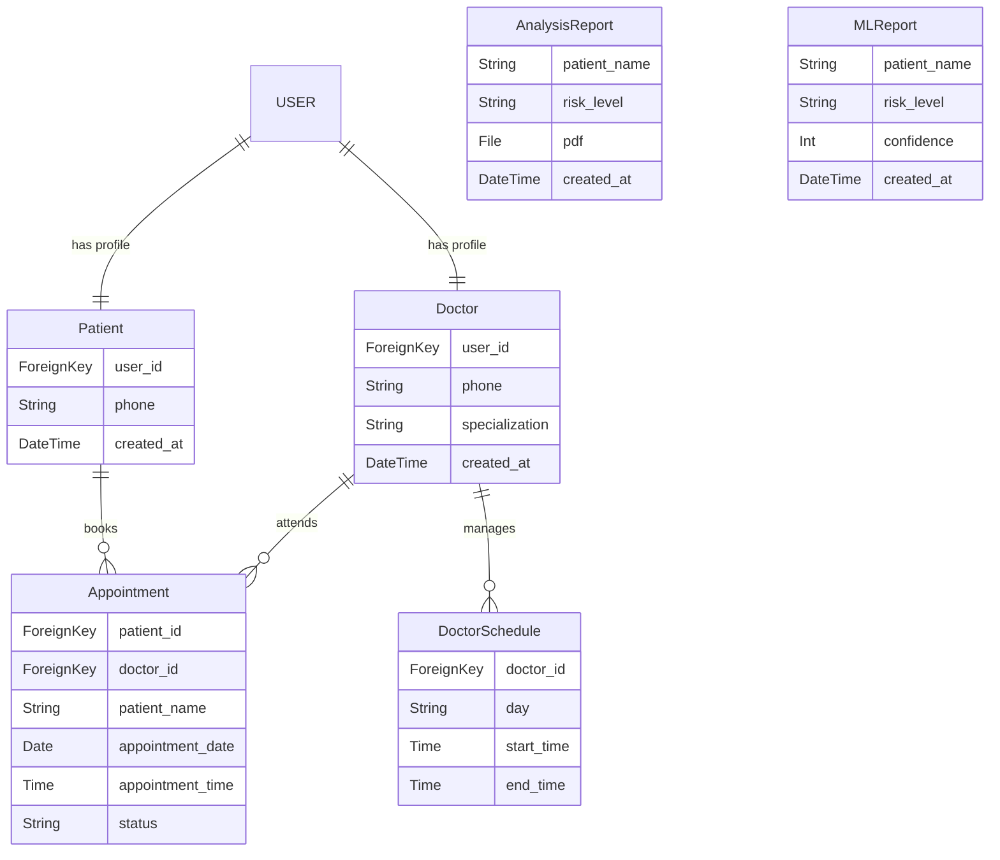
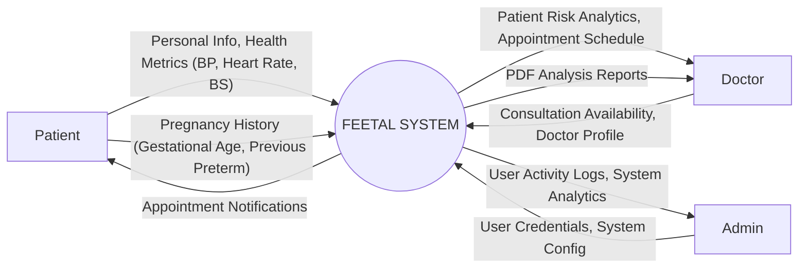
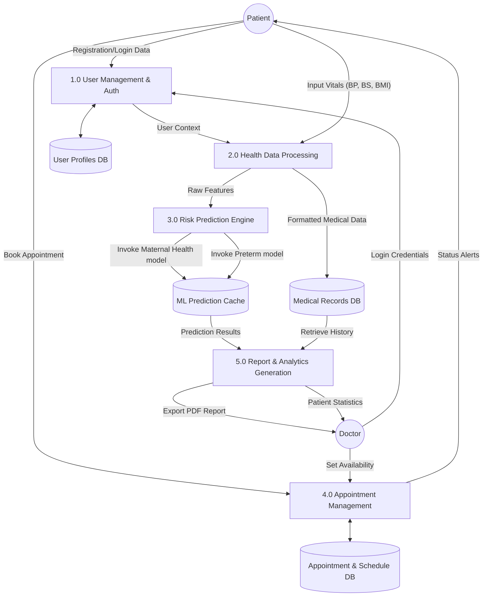
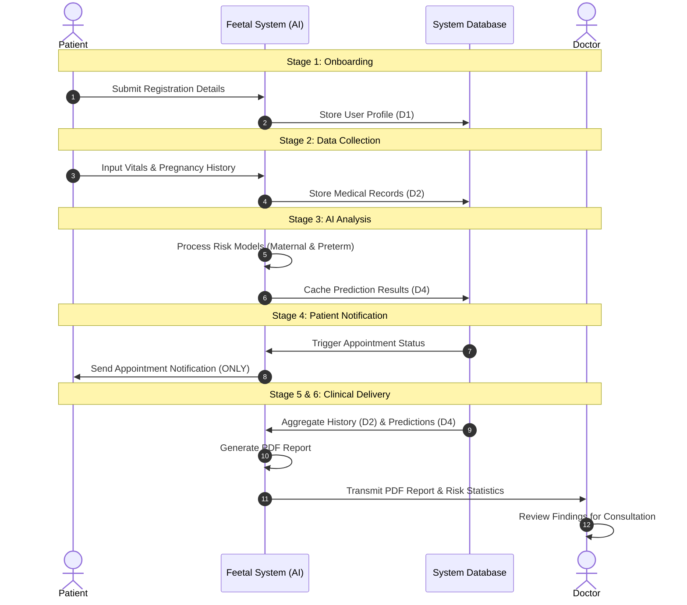

# 3. SYSTEM SPECIFICATIONS

## 3.1 HARDWARE SPECIFICATION

| Component | Minimum Requirement |
| :--- | :--- |
| **Processor** | Intel Core i3 or above |
| **System Bus** | 32-bit or 64-bit |
| **RAM** | 4 GB or above |
| **HDD / SSD** | 500 GB or above |
| **Monitor** | 14" LCD or above |
| **Keyboard** | 108 Keys |
| **Mouse** | Any Optical Mouse |

---

## 3.2 SOFTWARE SPECIFICATION

| Component | Specification |
| :--- | :--- |
| **Operating System** | Windows 10 / 11 (64-bit) |
| **Front End** | HTML5, CSS3, JavaScript (Django Templates) |
| **Back End** | Python (Django Framework) |
| **Database** | SQLite / MySQL Server |
| **AI / ML Library** | TensorFlow, Keras, Scikit-learn |
| **IDE** | Visual Studio Code / PyCharm |
| **Python Version** | 3.10 or above |

---

> [!NOTE]
> This specification is tailored for the **Feetal (FetoScope)** project, ensuring optimal performance for running machine learning models and processing medical reports.

---

## 3.3 DATABASE DESIGN (TABLES)

The following tables represent the core data structure of the **Feetal** system.

### 3.3.1 USER PROFILE TABLES

| Table Name | Columns | Description |
| :--- | :--- | :--- |
| **Patient** | `user_id` (FK), `phone`, `created_at`, `updated_at` | Stores detailed patient registration information. |
| **Doctor** | `user_id` (FK), `phone`, `specialization`, `created_at`, `updated_at` | Stores professional details of registered doctors. |

### 3.3.2 APPOINTMENT & SCHEDULE TABLES

| Table Name | Columns | Description |
| :--- | :--- | :--- |
| **Appointment** | `patient_id` (FK), `doctor_id` (FK), `patient_name`, `patient_email`, `patient_phone`, `patient_age`, `appointment_date`, `appointment_time`, `reason`, `notes`, `status` | Manages appointments between patients and doctors. |
| **DoctorSchedule**| `doctor_id` (FK), `day`, `start_time`, `end_time` | Manages availability slots for doctors. |

### 3.3.3 ANALYSIS & REPORT TABLES

| Table Name | Columns | Description |
| :--- | :--- | :--- |
| **AnalysisReport** | `patient_name`, `patient_email`, `combined_risk_level`, `pdf` (File), `created_at` | Stores generated PDF reports for patient analysis. |
| **MLReport** | `patient_name`, `analysis_type`, `risk_level`, `confidence`, `findings`, `created_at` | Stores metadata and results of machine learning predictions. |

### 3.3.4 ENTITY RELATIONSHIP DIAGRAM (ERD)

---

## 3.4 DATA FLOW DIAGRAM (DFD)

The following diagrams illustrate the movement of data through the Feetal (FetoScope) system, from user input to AI-driven analysis and report generation.

### 3.4.1 LEVEL 0 DFD (CONTEXT DIAGRAM)
The Context Diagram shows the system boundary and its interactions with external entities.

### 3.4.2 LEVEL 1 DFD
The Level 1 DFD decomposes the system into functional processes and identifies data stores.

---

### 3.4.3 STEP-BY-STEP DATA FLOW PROCESS

The following steps define the complete operational flow of data within the Feetal system:

1.  **Stage 1: User Onboarding**
    *   **Patient/Doctor** provides registration details to **Process 1.0**.
    *   Data is validated and stored in **D1 (User Profiles DB)**.

2.  **Stage 2: Health Data Collection**
    *   **Patient** enters vitals (BP, Heart Rate, BS) and pregnancy history (Gestational Age, BMI) via the portal.
    *   **Process 2.0** normalizes this data and stores it in **D2 (Medical Records DB)**.

3.  **Stage 3: AI Inference & Analysis**
    *   **Process 3.0** retrieves raw features from Process 2.0.
    *   The system invokes the **Maternal Health** and **Preterm Delivery** ML models.
    *   Predictions and confidence scores are cached in **D4 (ML Prediction Cache)**.

4.  **Stage 4: Communication & Alerting**
    *   **Process 4.0** checks for appointment availability in **D3**.
    *   System sends an **Appointment Notification** (SMS/Email/In-app) to the **Patient**.
    *   *Note: No risk data is included in this user-facing notification.*

5.  **Stage 5: Report Synthesis (Doctor-Only)**
    *   **Process 5.0** aggregates patient medical history from **D2** and ML results from **D4**.
    *   A comprehensive **PDF Analysis Report** is generated.

6.  **Stage 6: Clinical Delivery**
    *   The **PDF Report** and visualized **Risk Statistics** are transmitted to the **Doctor's Dashboard**.
    *   Doctor reviews the findings for clinical consultation.

---

### 3.4.4 STEP-BY-STEP SEQUENCE DIAGRAM

The following sequence diagram provides a detailed, step-by-step visualization of how data interacts between entities, processes, and data stores throughout the entire system lifecycle.

---
